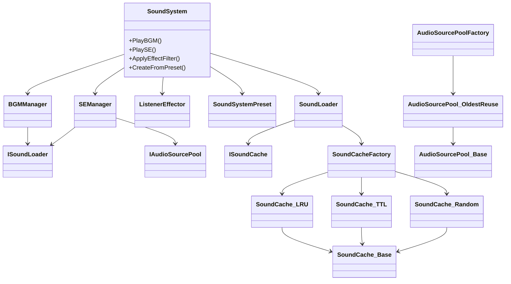

# SoundSystem for Unity 🎧

## 目次
- [概要](#概要)
- [使用技術](#使用技術)
- [システム構成](#システム構成)
- [機能のピックアップ](#機能のピックアップ)
- [セットアップ](#セットアップ)
- [基本的な使い方](#基本的な使い方)

---

## 概要

Unity向けの柔軟で拡張可能なサウンド管理システムです。  
**BGM / SE / AudioMixerの統合制御、プリセットによる一括設定、AudioSourceプール、キャッシュ方式の選択、ログ出力機構**などを備えています。

---

## 使用技術

- C#
- Addressables
- UniTask
- Unity AudioMixer

---

## システム構成



---

## 機能のピックアップ

### 🎛 SoundSystem.cs  
- 外部APIを集約するファサードクラス  
- `CreateFromPreset` によりプリセットベースの初期化が可能

### 🎵 BGMManager.cs / SEManager.cs  
- BGMは `FadeIn`, `FadeOut`, `CrossFade` に対応  
- SEは `AudioSourcePool` による再利用・一時停止・一括停止に対応

### 💽 SoundLoader.cs  
- Addressablesを用いた非同期ロード  
- `TryLoadClip` により失敗時も例外を抑制しログ出力可能  

### 💾 SoundCacheFactory.cs + 派生クラス群  
- LRU / TTL / Random の3種から削除方式を選択可能  
- `ISoundCache` インターフェースを通して抽象化

### 🎚 ListenerEffector.cs  
- `AudioReverbFilter` などのAudioFilterを動的に適用・無効化

### 📜 Log.cs  
- クラス名を自動カテゴリ化しログ出力（Safe / Warn / Error）を一元管理  
- 実行ログ、警告ログ、エラーログの分類に対応

---

## セットアップ

### 1. UniTask・Addressablesの導入
本プロジェクトは `UniTask`, `Addressables` を前提としています。

### 2. パッケージのインポート
`SoundSystem.unitypackage` をUnityプロジェクトにインポートします。

### 3. SoundSystemインスタンス生成
手動構成 or プリセットベースで生成できます。

```csharp
// 手動構成の例
var cache = SoundCacheFactory.Create(SoundCacheType.LRU, 30f);
var pool  = AudioSourcePoolFactory.CreateOldestReuse(mixerGroup, 8, 32);
var soundSystem = new SoundSystem(cache, pool, mixer, mixerGroup);

// プリセットから生成
var soundSystem = SoundSystem.CreateFromPreset(preset, pool, mixer, mixerGroup);
```

---

## 基本的な使い方

### 🎵 BGM再生

```csharp
// 通常再生
await soundSystem.PlayBGM("bgm_title", 1.0f);

// フェード再生
await soundSystem.FadeInBGM("bgm_intro", 2.0f, 1.0f);

// クロスフェード
await soundSystem.CrossFadeBGM("bgm_battle", 2.0f);

// プリセット再生
await soundSystem.PlayBGMWithPreset("bgm_battle", "BattlePreset");
```

### 🔊 SE再生

```csharp
// 通常再生
await soundSystem.PlaySE("se_click", Vector3.zero, 1.0f, 1.0f, 1.0f);

// プリセット再生
await soundSystem.PlaySEWithPreset("se_explosion", "ExplosionPreset");
```

### 🎚 Mixer操作

```csharp
// 音量パラメータの取得・設定
float? volume = soundSystem.RetrieveMixerParameter("MasterVolume");
soundSystem.RetrieveMixerParameter("MasterVolume", -10.0f);
```

### 🎧 エフェクト適用

```csharp
// リバーブフィルター適用
soundSystem.ApplyEffectFilter<AudioReverbFilter>(
    filter => filter.reverbLevel = 1000f);

// 全フィルター無効化
soundSystem.DisableAllEffectFilter();
```
